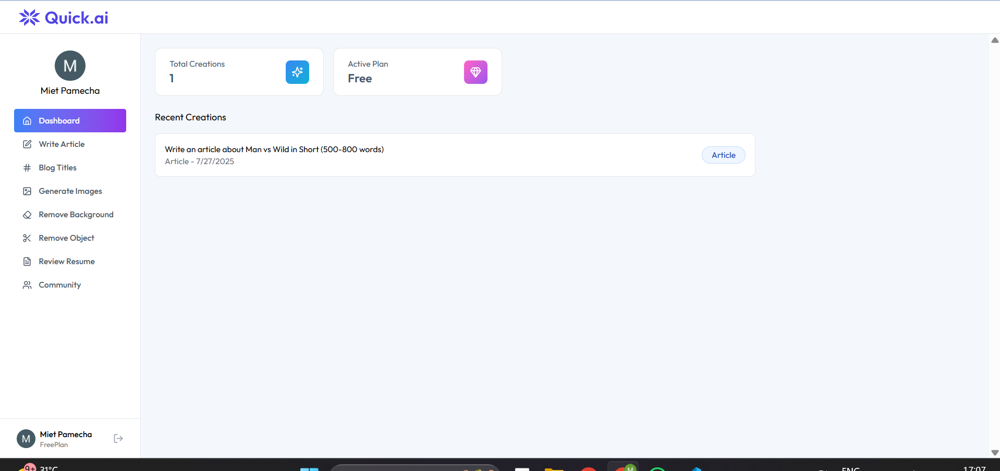
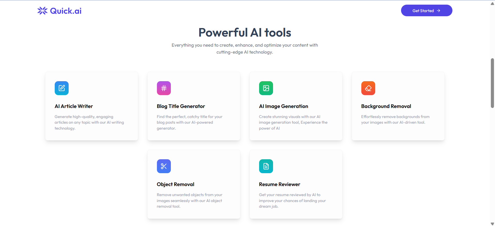
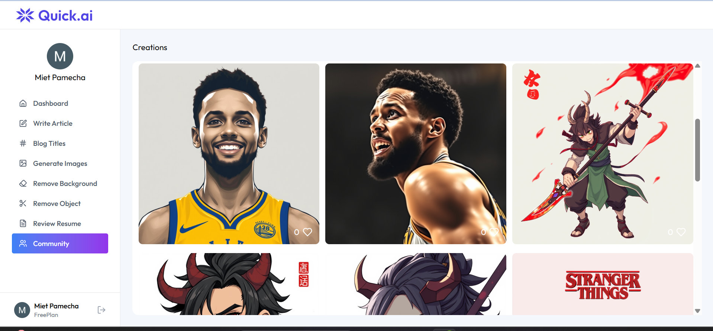

# QuickAI - All-in-One AI Tools SaaS Platform

🚀 **[Live Demo](https://quick-ai-mu.vercel.app/)**

A comprehensive SaaS platform that provides powerful AI-driven tools for content creation and image processing, all in one convenient location.

---

## 🚀 Features

- **📝 Content Generation**: 
  - Generate high-quality articles with AI
  - Create engaging blog titles
- **🖼️ Image Processing**: 
  - Remove backgrounds from images
  - Remove unwanted objects from photos
  - AI-powered image generation
- **📄 Resume Analysis**: AI-powered resume review and feedback
- **👥 Community**: User community features and interaction
- **🔐 User Authentication**: Secure user management with Clerk
- **💳 Billing Integration**: Seamless payment processing and subscription management
- **📊 Dashboard**: Comprehensive user dashboard for managing all tools

## 🛠️ Tech Stack

### Frontend
- **ReactJS** - Modern React with latest features
- **Vite** - Lightning-fast build tool and development server
- **Tailwind CSS** - Latest utility-first CSS framework
- **Lucide React** - Beautiful icon library

### Backend
- **Node.js** - JavaScript runtime
- **Express.js** - Latest Express web framework

### Database
- **Neon PostgreSQL** - Serverless PostgreSQL database

### Authentication & Billing
- **Clerk Express** - Complete user authentication and billing solution

### APIs & Services
- **OpenAI** - AI content generation and processing
- **Gemini API** - Google's AI for advanced text generation
- **Clipdrop API** - Advanced image processing and manipulation
- **Cloudinary** - Image and video management platform
- **Multer** - File upload handling


## 🔧 Environment Variables

Create environment files in both client and server directories:

**Backend (.env in server folder):**
```env
# Database
DATABASE_URL=your_neon_postgresql_connection_string

# Clerk Authentication
CLERK_SECRET_KEY=your_clerk_secret_key

# AI APIs
GEMINI_API_KEY=your_gemini_api_key
CLIPDROP_API_KEY=your_clipdrop_api_key

# Cloudinary Configuration
CLOUDINARY_CLOUD_NAME=your_cloudinary_cloud_name
CLOUDINARY_API_KEY=your_cloudinary_api_key
CLOUDINARY_API_SECRET=your_cloudinary_api_secret
```

**Frontend (.env in client folder):**
```env
# Clerk Configuration
VITE_CLERK_PUBLISHABLE_KEY=your_clerk_publishable_key

# Backend URL
VITE_BASE_URL=http://localhost:5173
```

## 🚀 Installation & Setup

1. **Clone the repository**
   ```bash
   git clone https://github.com/miet2005/QuickAI.git
   cd QuickAI
   ```

2. **Install backend dependencies**
   ```bash
   cd server
   npm install
   ```

3. **Install frontend dependencies**
   ```bash
   cd ../client
   npm install
   ```


4. **Start the development servers**
   
   **Backend server:**
   ```bash
   cd server
   npm run server
   # Server runs on http://localhost:3000
   ```
   
   **Frontend server (in new terminal):**
   ```bash
   cd client
   npm run dev
   # Frontend runs on http://localhost:5173
   ```

## 🖥️ Usage

### Main Features:

1. **🏠 Home**: Landing page with overview of all available tools
2. **📝 Write Article**: Generate comprehensive articles using Gemini AI
3. **📰 Blog Titles**: Create catchy blog titles for your content
4. **🎨 Generate Images**: Create AI-generated images for your projects
5. **✂️ Remove Background**: Upload images to remove backgrounds automatically
6. **🗑️ Remove Object**: Remove unwanted objects from your photos
7. **📄 Review Resume**: Upload your resume for AI-powered analysis and feedback
8. **👥 Community**: Connect with other users and share experiences
9. **📊 Dashboard**: Manage your account, usage, and billing
10. **💳 Billing**: Handle subscriptions and payments through Clerk integration

### Getting Started:
1. **Sign Up/Login**: Create an account using Clerk authentication
2. **Choose Your Tool**: Navigate to any feature from the dashboard
3. **Upload/Input**: Provide the necessary content (text, images, documents)
4. **Process**: Let AI handle the heavy lifting
5. **Download/Copy**: Get your results instantly

## 📸 Screenshots

### Home Page


### Dashboard


### AI Tools


### Community


## 📁 Project Structure

```
QuickAI/
├── client/                    # Frontend (Vite + React + Tailwind)
│   ├── src/
│   │   ├── components/        # Reusable UI components
│   │   ├── pages/            # Application pages
│   │   │   ├── BlogTitles.jsx    # Blog title generation
│   │   │   ├── WriteArticle.jsx  # Article writing
│   │   │   ├── GenerateImages.jsx # AI image generation
│   │   │   ├── RemoveBackground.jsx # Background removal
│   │   │   ├── RemoveObject.jsx  # Object removal
│   │   │   ├── ReviewResume.jsx  # Resume analysis
│   │   │   ├── Dashboard.jsx     # User dashboard
│   │   │   ├── Community.jsx     # Community features
│   │   │   ├── Home.jsx         # Landing page
│   │   │   └── Layout.jsx       # Main layout component
│   │   ├── assets/           # Static assets (images, icons)
│   │   ├── App.jsx          # Main App component
│   │   ├── main.jsx         # React entry point
│   │   └── index.css        # Global styles
│   ├── public/              # Public assets
│   ├── package.json         # Frontend dependencies
│   ├── tailwind.config      # Tailwind CSS configuration
│   ├── vite.config          # Vite configuration
│   └── .env                 # Environment variables
├── server/                  # Backend (Express + Node.js)
│   ├── configs/             # Configuration files
│   │   ├── cloudinary.js    # Cloudinary setup
│   │   ├── db.js           # Database connection
│   │   └── multer.js       # File upload configuration
│   ├── controllers/         # Business logic
│   │   ├── aiController.js  # AI operations (Gemini, image processing)
│   │   └── userController.js # User management
│   ├── middlewares/         # Custom middleware
│   │   └── auth.js         # Authentication middleware
│   ├── routes/             # API endpoints
│   │   ├── aiRouter.js     # AI-related routes
│   │   └── userRoutes.js   # User-related routes
│   ├── server.js           # Main server file
│   ├── package.json        # Backend dependencies
│   └── .env                # Server environment variables
├── .gitignore              # Git ignore rules
└── README.md               # Project documentation
```

## 🚀 Deployment

This project is deployed on **Vercel** and can be accessed at: **[https://quick-ai-mu.vercel.app/](https://quick-ai-mu.vercel.app/)**


## 📊 Performance & Features

- ⚡ **Fast Loading**: Vite-powered development and build
- 🎨 **Modern UI**: Tailwind CSS with responsive design
- 🔒 **Secure**: Clerk authentication with middleware protection
- 📱 **Mobile Friendly**: Responsive design for all devices
- ☁️ **Cloud Storage**: Cloudinary integration for file management
- 🗄️ **Serverless DB**: Neon PostgreSQL for scalable data storage
---

Made with ❤️ by [Miet Pamecha]
